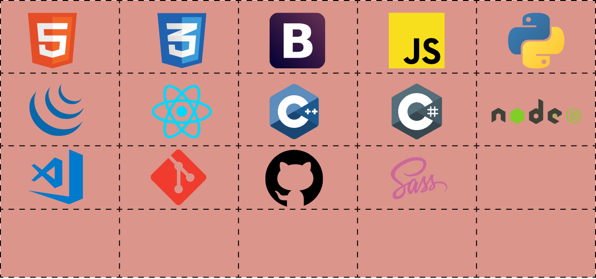

<h1 align="center"> Find me at: </h1>

<h1 align="center">About Me </h1>

A passionate and determined developer who's on a journey to be at the top of her academics while not compromising on her skills. 

A creative developer who has a keen eye for aesthetically pleasing User Interfaces and loves playing around with different layouts. Started with plain HTML, and CSS and went on an expedition towards React, creating a little more advanced webpages. It was during this roadmap, this confused yet spirited developer realized how much she enjoys observing the users' behavior regarding a UI. This curiosity led this coder to discover more about UI/UX design. Thus, these days this person is engaged in learning more about design theories along with developing alluring websites.

Nevertheless, this user loves reading books and spends a great deal of time reading books of different genres. Oh, and before its forgetton to mention, this user is addicted to chai and can be used as a method to abduct.

Fingers crossed for me to inspire more people along my way!

<h1 align="center"> Stackoverflow Reputation </h1>

  

<h1 align="center"> GitHub Statistics </h1>

 
  
  

<h1 align="center">Coding Activity</h1>

<h3 align="center">Show some ❤️ by starring some of the repositories!</h3>
